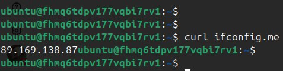

### Задание 1 

* скриншот ЛК Yandex Cloud с созданной ВМ, где видно внешний ip-адрес


* скриншот консоли, curl должен отобразить тот же внешний ip-адрес



* ответы на вопросы

1) `preemptible = true`

Для чего это может пригодиться:

    Экономия затрат:
        Preemptible VMs стоят на 60-90% дешевле обычных виртуальных машин. Это отличный способ сэкономить, если есть задачи, которые не требуют высокой доступности или могут быть прерваны без серьезных последствий.

    Пакетные задачи (batch processing):
        Если есть задачи, которые можно разбить на части и выполнять параллельно (например, обработка данных, рендеринг видео, тестирование), preemptible VMs отлично подойдут. Даже если некоторые машины будут прерваны, оставшиеся завершат работу.

    Тестирование и разработка:
        Для тестовых сред или разработки, где не требуется высокая доступность. Они позволяют развернуть инфраструктуру для тестирования с минимальными затратами.

    Распределенные вычисления:
        Если используются распределенные системы (например, Hadoop, Spark), preemptible VMs могут быть полезны для выполнения задач, которые могут быть перераспределены в случае прерывания.

    Кратковременные задачи:
        Для задач, которые выполняются недолго (например, CI/CD pipelines, периодические скрипты). Они дешевы и подходят для краткосрочных нагрузок.

2) `core_fraction=5`

    Ограничение использования CPU:  
        core_fraction указывает, какой процент вычислительной мощности одного виртуального ядра CPU будет гарантированно доступен для ВМ.
        Например:
            core_fraction = 5 означает, что ВМ получит 5% мощности одного виртуального ядра.
            core_fraction = 100 означает, что ВМ получит полную мощность одного виртуального ядра.
             

    Экономия ресурсов и затрат:  
        Если ВМ не требует постоянной высокой нагрузки на CPU, можно использовать низкие значения core_fraction (например, 5 или 20), чтобы снизить стоимость.
        Это особенно полезно для задач, которые требуют небольшой производительности (например, тестовые среды, малонагруженные сервисы, обучение так же хорошо подходит).
         

    Гибкость для разных типов нагрузок:  
        Для приложений с неравномерной нагрузкой можно выбрать промежуточные значения (например, core_fraction = 50), чтобы обеспечить баланс между стоимостью и производительностью.
         

### Задание 2

* Проверьте terraform plan. Изменений быть не должно.

```
─[$] <> terraform plan 
data.yandex_compute_image.ubuntu: Reading...
yandex_vpc_network.develop: Refreshing state... [id=enp3s8ob3i27oh8jj29h]
data.yandex_compute_image.ubuntu: Read complete after 0s [id=fd84f596tp5sv9tjvmc0]
yandex_vpc_subnet.develop: Refreshing state... [id=e9brqh4ch4m927ji1uu7]
yandex_compute_instance.platform: Refreshing state... [id=fhm8l69tjcvqcc5m4vme]

No changes. Your infrastructure matches the configuration.

Terraform has compared your real infrastructure against your configuration and found no differences, so no changes are needed.
```

### Задание 4

* приложите вывод значений ip-адресов команды `terraform output`

```
└─[$] <> terraform output
instances_info = {
  "db_vm" = {
    "external_ip" = "158.160.39.8"
    "fqdn" = "fhmbla2hb7392qom0kb3.auto.internal"
    "instance_name" = "netology-develop-platform-db"
  }
  "web_vm" = {
    "external_ip" = "89.169.129.244"
    "fqdn" = "fhm8l69tjcvqcc5m4vme.auto.internal"
    "instance_name" = "netology-develop-platform-web"
  }
}
```

### Задание 5

* опишите в одном local-блоке имя каждой ВМ, используйте интерполяцию

```
locals {
  # Общие префиксы для имен ВМ
  vm_prefix = "netology-develop"
  env_suffix = "platform"

  # Имена ВМ через интерполяцию
  vm_web_name = "${local.vm_prefix}-${local.env_suffix}-web"
  vm_db_name = "${local.vm_prefix}-${local.env_suffix}-db"
  
}
```

### Задание 6

* пример выноса переменных и применение их в коде

```
variable "vms_resources" {
  type = map(object({
    cores         = number
    memory        = number
    core_fraction = number
  }))
  default = {
    web = {
      cores         = 2
      memory        = 1
      core_fraction = 5
    }
    db = {
      cores         = 2
      memory        = 2
      core_fraction = 20
    }
  }
}
```

