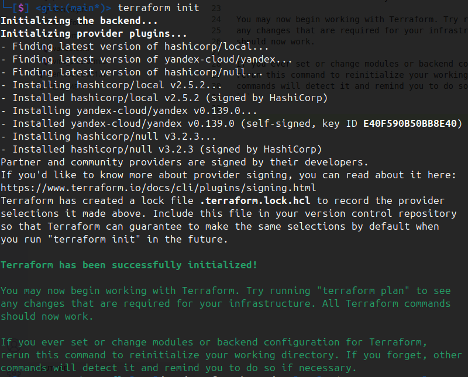
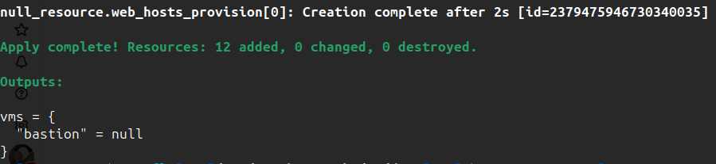
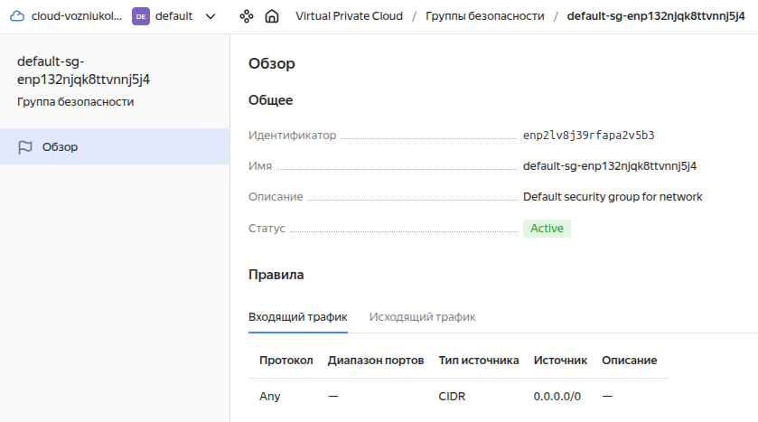
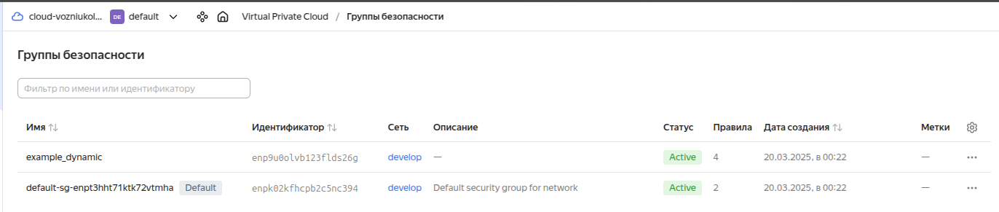
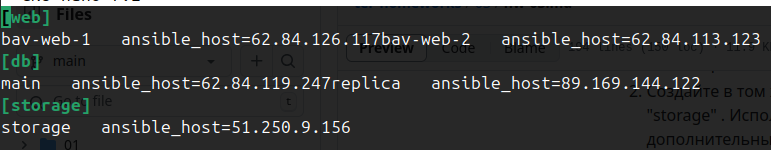
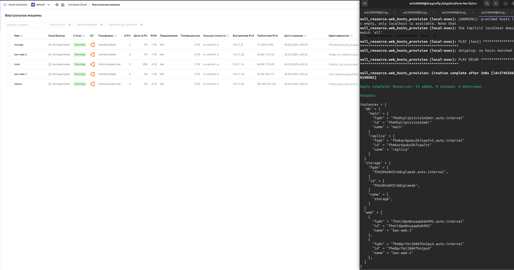

# Домашнее задание к занятию «Управляющие конструкции в коде Terraform»
------

1) Приложите скриншот входящих правил «Группы безопасности» в ЛК Yandex Cloud

* Init

* Apply

* Demo security groups

2) Задание 2 выполнено полностью, код доступен в ветке

3) Задание 3 выполнено полностью, код доступен в ветке

4) Скриншоты результатов

* Security groups

* Final inventory file

* VM output

> Для общего зачёта создайте в вашем GitHub-репозитории новую ветку terraform-03. Закоммитьте в эту ветку свой финальный код проекта, пришлите ссылку на коммит.   

**Удалите все созданные ресурсы**.

> готово