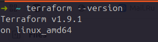
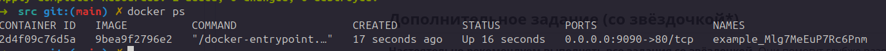
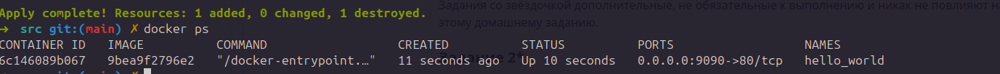
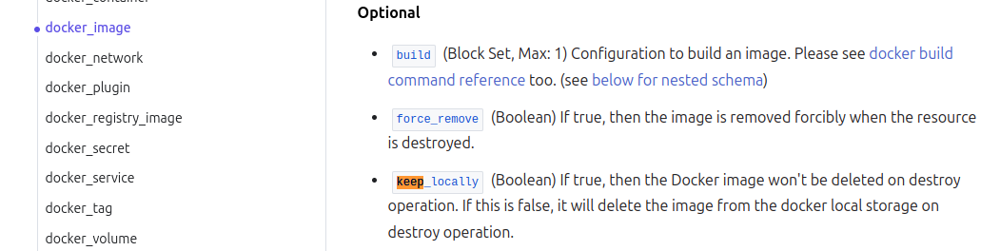

# Домашние задания по модулю «Облачная инфраструктура. Terraform»

В этом репозитории расположены ваши домашние задания к каждой лекции. 

Обязательными к выполнению являются задачи без указания звездочки. Их выполнение необходимо для получения зачета и диплома о профессиональной переподготовке.

Задачи со звездочкой (*) являются дополнительными задачами и/или задачами повышенной сложности. Они не являются обязательными к выполнению, но помогут вам глубже понять тему.

Любые вопросы по решению задач задавайте в чате курса.


1. [Ввдение в Terraform](01/hw-01.md)

2. [Основы Terraform. Yandex Cloud](02/hw-02.md)

3. [Управляющие конструкции в коде Terraform](03/hw-03.md)

4. [Продвинутые методы работы с Terraform](04/hw-04.md)

5. [Использование Terraform в команде](05/hw-05.md)


## Домашнее задание "Введение в Terraform"



```
"result": "Mlg7MeEuP7Rc6Pnm"
```
 Terraform требует, чтобы все ресурсы имели два метки: тип и имя. Например, docker_image и nginx.

 ```
 resource "docker_image" "nginx" {
  name         = "nginx"
  keep_locally = true
}

resource "docker_container" "example_nginx" {
  image = docker_image.nginx.image_id
  name  = "example_${random_password.random_string.result}"
}
```




```
{
  "version": 4,
  "terraform_version": "1.9.1",
  "serial": 13,
  "lineage": "9361b502-559c-94a7-6884-c3f1929d1927",
  "outputs": {},
  "resources": [],
  "check_results": null
}
```
docker-образ nginx:latest не был удален, потому что был сохранен в локальном реестре

